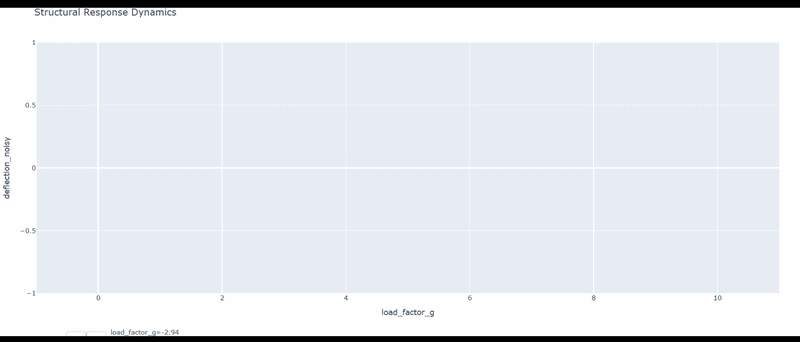

{
 "cells": [
  {
   "cell_type": "markdown",
   "id": "b10de0ad",
   "metadata": {},
   "source": [
    "# Aircraft Wing Spar: Structural Health Monitoring\n",
    "> **Data-Driven Analysis of Beam Deflection and Elastic Limits**\n",
    "\n",
    "\n",
    "\n",
    "## Project Overview\n",
    "This repository contains a computational pipeline for monitoring the structural health of an aircraft wing spar. By processing telemetry from **Node 19**, the system validates the proportional relationship between aerodynamic load factors (G) and structural deflection (mm), ensuring the airframe operates within safe mechanical limits.\n",
    "\n",
    "## Key Features\n",
    "* **Automated Data Cleaning:** Handles missing sensor packets and isolates specific node telemetry.\n",
    "* **Statistical Validation:** Verified a Pearson Correlation Coefficient (r) of **0.9998**.\n",
    "* **Dynamic Visualization:** Interactive Plotly models optimized for web deployment.\n",
    "* **Performance Optimization:** Implemented data decimation to reduce HTML payload for GitHub Pages.\n",
    "\n",
    "---\n",
    "\n",
    "## Tech Stack\n",
    "\n",
    "\n",
    "\n",
    "\n",
    "\n",
    "---\n",
    "\n",
    "## Repository Structure\n",
    "* `data/`: Raw CSV telemetry dataset.\n",
    "* `outputs/`: Generated GIF, static plots, and interactive HTML models.\n",
    "* `main.py`: Core logic for data processing and analysis.\n",
    "* `requirements.txt`: Environment dependencies.\n",
    "\n",
    "---\n",
    "\n",
    "## Live Simulation\n",
    "Access the interactive digital twin here:  \n",
    "**[View Live Wing Spar Animation](https://kurtamn70-png.github.io/P3_SOL1_BeamDeflection_ElasticLimits_TUPM-25-0593_Amandy/outputs/animation_structural_response.html)**\n",
    "\n",
    "---\n",
    "\n",
    "**Student:** Kurt Andrew Amandy  \n",
    "**Student ID:** TUPM-25-0593  \n",
    "**Institution:** Technological University of the Philippines - Manila"
   ]
  }
 ],
 "metadata": {
  "kernelspec": {
   "display_name": ".venv (3.14.2)",
   "language": "python",
   "name": "python3"
  },
  "language_info": {
   "name": "python",
   "version": "3.14.2"
  }
 },
 "nbformat": 4,
 "nbformat_minor": 5
}
